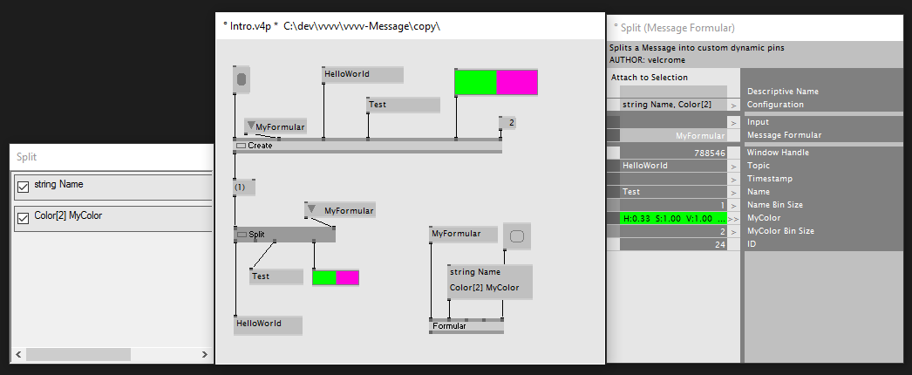
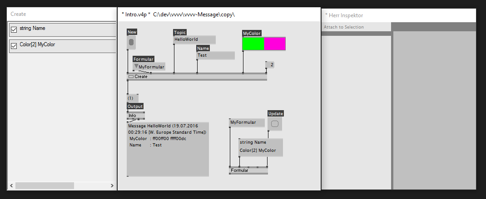
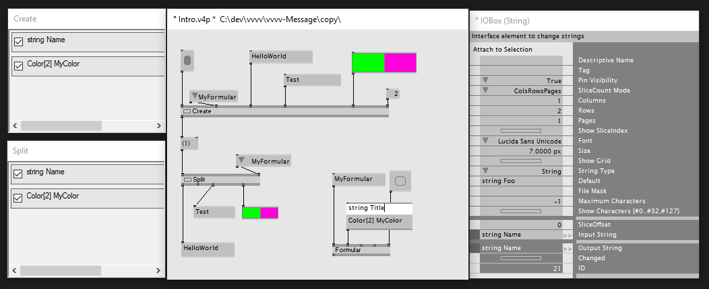
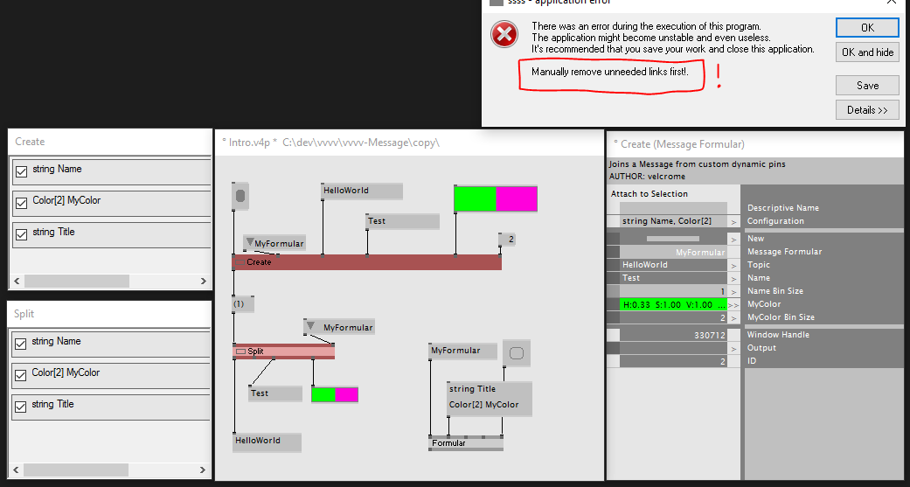
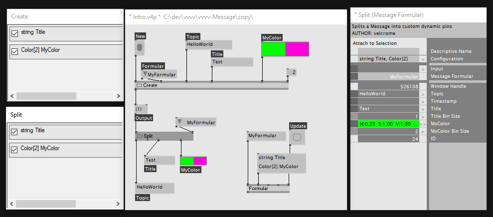

The Message Nodes
=================

If you've ever wondered, if there is a smarter way to pack pins and links into some kind of "objects" in vvvv, you've come to the right place. *Message* is a versatile data structure.

This pack is a suite of user-centered nodes to allow basic object oriented programming in good old vvvv. They allow you to

* `Create (Message)` *Message* instances from core vvvv types as inputs through named and typed pins
* `Edit (Message)` and `Split (Message)` *Messages*
* help you to facilitate memory persistence through custom archive Nodes in the  *Message Keep* category
* reshaping *Message*s to dock one API to another 
* serialize from and to _Json_, _MsgPack_ and _OSC_
* also, refer to vvvv-ZeroMQ for all networking business on steroids

It's nodes are modeled to the principle of typed code, rapid workflow, resilience, and readability.

First Things First
==================

First thing to be asked is usually: "How does it improve my patching experience". `Create (Message)`

The first thing is, that you can bundle a bunch of varied output spreads into a single *Message*. Just right-click it and you will see its pin configuration. 
double-click to prepare another pin, just rename it and see, make sure it is checked for usage. 

To do so, you simply type its *Type* and its name, separated by a whitespace. If you are into it, you can even use array syntax.
You can infuse any number of pins into one or many *Message*s (if many, just make sure your array sizes are correct).

Interfacing back to vvvv is done the exact same way by `Split (Message)`. 

It might not strike you as surprising, `Edit (Message)` uses the same UI to help you edit an existing *Message*

While patching along, you'll explore the dynamic approach to OOP: you can have a slightly different use for all nodes, and have to make sure you are still on the same page with every node.

Of course, this is hard on the mind, especially in larger projects that might need to be maintained for some time. So there is a different, stricter mode built into this pack, helping you to define a *Message Formular*, which acts as a kind of template for a whole bunch of nodes. This template is known across your vvvv application, so it'S easy to apply the Formular to any of the mentioned nodes, and guide you to a proper object oriented data stream.

Refactoring
===========

Using strict *Formular*s brings something akin to IntelliSense to vvvv. It hightlights problems, so you can fix them.

If later on during your project, you decide to rename a few things, that you yet know more about conceptually, you can do so safely.

After renaming it in for the `Formular (Message)`, press Update on it, and it will attempt to "autofix" all involved nodes. Everywhere this fix would break links, it will light up in red, until you manually cleared the link situation. 
This "exceptional" behaviour does not induce problems to the node itself, it will be working and processing data like before, even if it rings the alarm.

Introduction
============

Think of *Message* as a collection of (binsizeable) Spreads of various Types 

* *bool*
* *int*
* *float*
* *double*
* *string*

* *Vector2d*
* *Vector3d*
* *Vector4d*

* *Transform* 
* *Color* - with alpha 
* *Raw* - a.k.a. Stream 
* *Time* - from tmp's [Time](https://github.com/letmp/vvvv-Time)

* **Message** - yes, it is recursive

Basic nodes such as `Create (Message)`, `Split (Message)`, `Edit (Message)` allow interfacing these vvvv link types easily. Right-Click any node to see it's defining Formular, and check which one's of them you need as pins.

When you don't have a formular selected, you can create a dynamic pin layout by simply double-clicking into the empty area of the Formular and editing any descriptor. 

Note, that all pins are accompanied by a hidden bin size. This means, that any field of a **Message** can be one or many items.

Also you'll see that all access to the fields of a message is "named"- including the vvvv pins. You can use `Read (Message)` and `Write (Message)` to that advantage.

Formular
========

Keep
====

Have you ever had too many links in your project? 

Maybe your project was even so cluttered in links, it became necessary to Zip and Cons stuff together, and pick it apart somewhere else. In this case it is hard to remember what's what, and hence even harder to maintain the project long term?

This happened to you, while you used S and R nodes? 
